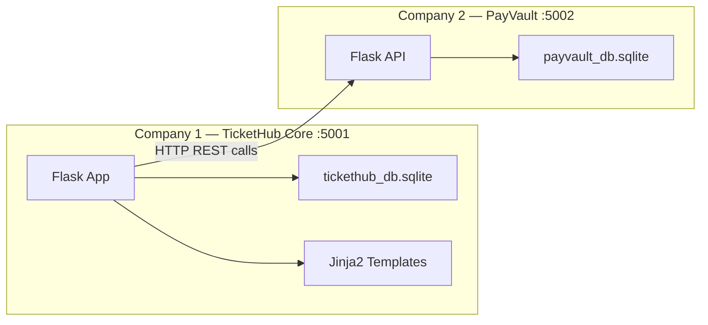

# TicketHub — Multi-Company Microservice System

A two-service ticketing platform built with **Python (Flask)** and **SQLite**, featuring a premium web UI served by Flask templates.

## Architecture Overview



- **TicketHub Core** serves the full user-facing web app (HTML/CSS/JS via Jinja2) and admin dashboard.
- **PayVault** is a headless REST API — no UI, only called internally by TicketHub Core.

---

## Proposed Changes

### Project Structure

```
tickethub/
├── tickethub_core/              # Company 1
│   ├── app.py                   # Flask app, routes, config
│   ├── models.py                # SQLAlchemy models (User, Event, Booking, Review)
│   ├── payvault_client.py       # HTTP client to call PayVault API
│   ├── tickethub_db.sqlite      # auto-created
│   ├── static/
│   │   ├── css/
│   │   │   └── style.css        # Full design system
│   │   └── js/
│   │       └── main.js          # Client-side interactivity
│   └── templates/
│       ├── base.html            # Layout shell (nav, footer, toasts)
│       ├── index.html           # Landing / event browse
│       ├── login.html           # Login form
│       ├── register.html        # Register form
│       ├── event_detail.html    # Single event + booking + reviews
│       ├── my_bookings.html     # User's bookings list
│       ├── admin/
│       │   ├── dashboard.html   # Revenue, tickets sold, upcoming events
│       │   ├── events.html      # CRUD events
│       │   ├── event_form.html  # Add/edit event form
│       │   ├── bookings.html    # All bookings
│       │   └── users.html       # All users
│       └── partials/
│           └── _toast.html      # Flash message partial
│
├── payvault/                    # Company 2
│   ├── app.py                   # Flask API app
│   ├── models.py                # SQLAlchemy models (Transaction)
│   └── payvault_db.sqlite       # auto-created
│
├── requirements.txt             # Shared dependencies
├── run_all.py                   # Script to launch both services
└── seed.py                      # Seed sample data
```

---

### Database Schemas

#### tickethub_db (Company 1)

| Table | Columns |
|-------|---------|
| **users** | `id`, `username`, `email`, `password_hash`, `is_admin`, `created_at` |
| **events** | `id`, `name`, `description`, `date`, `location`, `price`, `total_seats`, `available_seats`, `image_url`, `created_at` |
| **bookings** | `id`, `user_id` (FK), `event_id` (FK), `quantity`, `total_price`, `status` (confirmed/cancelled), `transaction_id`, `booked_at` |
| **reviews** | `id`, `user_id` (FK), `event_id` (FK), `rating` (1-5), `comment`, `created_at` |

#### payvault_db (Company 2)

| Table | Columns |
|-------|---------|
| **transactions** | `id`, `booking_id`, `amount`, `currency`, `status` (pending/confirmed/failed/refunded), `payment_method`, `created_at`, `updated_at` |

---

### Company 1 — TicketHub Core (port 5001)

#### [NEW] [app.py](file:///e:/All-code/workshop/tickethub/tickethub_core/app.py)
Flask application with routes:

**User routes:**
| Route | Method | Description |
|-------|--------|-------------|
| `/` | GET | Landing page — browse events |
| `/register` | GET/POST | User registration |
| `/login` | GET/POST | User login |
| `/logout` | GET | Logout |
| `/event/<id>` | GET | Event detail + review form |
| `/event/<id>/book` | POST | Book tickets (calls PayVault) |
| `/my-bookings` | GET | View user's bookings |
| `/booking/<id>/cancel` | POST | Cancel booking (calls PayVault refund) |
| `/event/<id>/review` | POST | Submit review + rating |

**Admin routes (require `is_admin`):**
| Route | Method | Description |
|-------|--------|-------------|
| `/admin/dashboard` | GET | Dashboard with stats |
| `/admin/events` | GET | List all events |
| `/admin/events/add` | GET/POST | Add event form |
| `/admin/events/<id>/edit` | GET/POST | Edit event form |
| `/admin/events/<id>/delete` | POST | Delete event |
| `/admin/bookings` | GET | All bookings |
| `/admin/users` | GET | All users |

- Uses Flask-Login for session management
- Passwords hashed with `werkzeug.security`

#### [NEW] [models.py](file:///e:/All-code/workshop/tickethub/tickethub_core/models.py)
SQLAlchemy models for User, Event, Booking, Review with relationships.

#### [NEW] [payvault_client.py](file:///e:/All-code/workshop/tickethub/tickethub_core/payvault_client.py)
HTTP client using `requests` to call PayVault API:
- `create_transaction(booking_id, amount)`
- `confirm_payment(transaction_id)`
- `refund_payment(transaction_id)`
- `get_transaction(booking_id)`

#### [NEW] Templates & Static Assets
Premium dark-themed UI with:
- Glassmorphism card components
- Gradient accents (purple → cyan palette)
- Smooth transitions and micro-animations
- Google Font: Inter
- Responsive layout (mobile-friendly)
- Admin dashboard with stat cards and charts

---

### Company 2 — PayVault (port 5002)

#### [NEW] [app.py](file:///e:/All-code/workshop/tickethub/payvault/app.py)
Flask REST API with JSON endpoints:

| Endpoint | Method | Description |
|----------|--------|-------------|
| `/api/transactions` | POST | Create a new transaction |
| `/api/transactions/<id>/confirm` | POST | Confirm payment |
| `/api/transactions/<id>/fail` | POST | Mark as failed |
| `/api/transactions/<id>/refund` | POST | Issue refund |
| `/api/transactions/booking/<booking_id>` | GET | Get transactions by booking |

#### [NEW] [models.py](file:///e:/All-code/workshop/tickethub/payvault/models.py)
SQLAlchemy model for Transaction.

---

### Shared Files

#### [NEW] [requirements.txt](file:///e:/All-code/workshop/tickethub/requirements.txt)
```
Flask
Flask-SQLAlchemy
Flask-Login
requests
werkzeug
```

#### [NEW] [run_all.py](file:///e:/All-code/workshop/tickethub/run_all.py)
Script that launches both services simultaneously using `subprocess`.

#### [NEW] [seed.py](file:///e:/All-code/workshop/tickethub/seed.py)
Populates both databases with:
- 1 admin user + 2 regular users
- 6 sample events
- A few sample bookings + transactions

---

## Design Direction

The UI will use a **dark theme** with a polished, premium feel:

| Element | Style |
|---------|-------|
| Background | Dark gradient (`#0f0f1a` → `#1a1a2e`) |
| Cards | Glassmorphism (translucent, blur, border) |
| Accent | Purple-cyan gradient (`#7c3aed` → `#06b6d4`) |
| Font | Inter (Google Fonts) |
| Buttons | Gradient fill with hover glow |
| Animations | Fade-in on scroll, hover scale, toast slide-in |
| Admin Dashboard | Stat cards with icons, recent activity table |

---

## Verification Plan

### Manual Verification
1. Run `pip install -r requirements.txt`
2. Run `python run_all.py` — both services start on ports 5001 and 5002
3. Run `python seed.py` — databases are populated
4. Test user flows: register → browse → book → view bookings → cancel → review
5. Test admin flows: login as admin → dashboard → manage events/bookings/users
6. Verify PayVault processes transactions correctly (check payvault_db)

### Automated Check
- `curl http://localhost:5002/api/transactions/booking/1` returns valid JSON
- Both services respond on their respective ports
